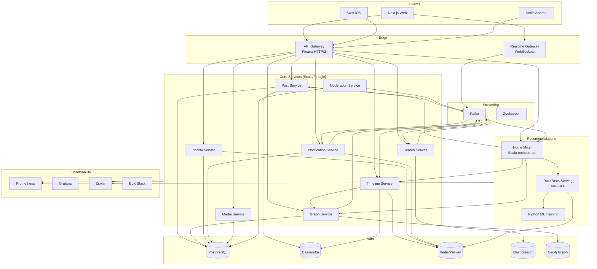
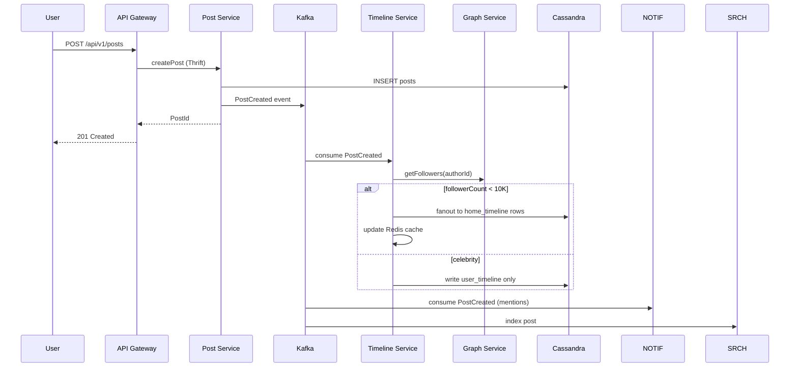

# OffMe Architecture

OffMe is a Twitter/X-inspired social media platform built as a microservices monorepo. The design mirrors production patterns from X: fanout-on-write for in-network timelines, pull-based hydration for celebrity accounts, a hybrid recommendation pipeline (Home Mixer), and event-driven async processing via Kafka.

## System Context



## Service Boundaries

| Service | Responsibility | Storage | Communication |
|---------|---------------|---------|---------------|
| **API Gateway** | Auth termination, rate limiting, request routing, BFF aggregation | Redis (sessions) | HTTP/2 → Thrift/gRPC |
| **Identity Service** | Registration, login, JWT, profiles, account settings | PostgreSQL, Redis | Thrift RPC |
| **Post Service** | Create/read posts, engagement counters, visibility rules | Cassandra (posts), PostgreSQL (metadata) | Thrift + Kafka events |
| **Timeline Service** | Fanout-on-write, home timeline reads, cache hydration | Cassandra (timelines), Redis | Thrift + Kafka consumer |
| **Graph Service** | Follow/unfollow, blocks, mutes, graph traversals | Neo4j, PostgreSQL | Thrift + Kafka |
| **Notification Service** | Like/reply/follow/mention notifications, push fanout | PostgreSQL, Redis | Thrift + Kafka |
| **Search Service** | Earlybird-style people/post search, typeahead | Elasticsearch | HTTP + Kafka indexer |
| **Media Service** | Upload, transcoding, CDN URL generation | S3-compatible, PostgreSQL | HTTP |
| **Moderation Service** | Visibility filtering, report handling, safety labels | PostgreSQL | Thrift + Kafka |
| **Home Mixer** | For You orchestration: candidate sourcing → ranking → filtering | Redis (feature cache) | Thrift to Recs + Timeline |
| **Recs Serving (Rust)** | Low-latency model inference, feature hydration | Redis, in-memory stores | gRPC |

## Timeline Strategy (Fanout-on-Write + Pull)

OffMe uses a hybrid timeline model identical to X's approach:

### Fanout-on-Write (Push)
When a user with **< 10,000 followers** posts:
1. Post Service writes to Cassandra `posts` table
2. Publishes `PostCreated` event to Kafka topic `offme.posts.created`
3. Timeline Service consumer reads event, fetches follower list from Graph Service
4. Writes post ID to each follower's `home_timeline` Cassandra row (bounded fanout batch)
5. Redis caches hot timelines for sub-millisecond reads

### Fanout-on-Read (Pull)
When a **celebrity** (>10K followers) posts:
1. Post is stored normally
2. Timeline Service does NOT fan out to all followers
3. On home timeline read, Timeline Service merges:
   - Pushed entries from `home_timeline` table
   - Pulled entries from followed celebrities via `user_timeline` table

### For You Timeline
Home Mixer orchestrates a 3-stage pipeline (inspired by [the-algorithm](https://github.com/twitter/the-algorithm)):

```
┌─────────────────┐    ┌──────────────────┐    ┌─────────────────┐
│ 1. Candidates   │ -> │ 2. Heavy Ranker  │ -> │ 3. Heuristics   │
│                 │    │                  │    │                 │
│ - In-network    │    │ - Rust ML serve  │    │ - Dedup         │
│ - Out-network   │    │ - Feature join   │    │ - Author divers │
│ - Trending      │    │ - Multi-task     │    │ - Visibility    │
│ - SimClusters   │    │   heads          │    │ - Feedback fat. │
└─────────────────┘    └──────────────────┘    └─────────────────┘
```

## Event Flow: Creating a Post



## Scalability Notes

- **Horizontal scaling**: All stateless services scale behind K8s HPA on CPU + custom metrics (p99 latency, Kafka lag)
- **Cassandra**: Partition by `user_id` for timelines; use TWCS compaction; RF=3 in prod
- **Redis**: Pelikan-compatible caching with TTL-based timeline segments; cache stampede protection via singleflight
- **Kafka**: Partition by `author_id` for ordering guarantees; 7-day retention for replay
- **Circuit breakers**: Finagle per-host circuit breakers on all RPC paths
- **Idempotency**: Post creation uses client-supplied `idempotency_key` stored in Redis (24h TTL)

## Observability

- **Metrics**: Prometheus histograms for `rpc_latency_seconds`, `timeline_fanout_size`, `recs_rank_latency`
- **Tracing**: Zipkin B3 propagation across Finagle, gRPC, and HTTP boundaries
- **Logging**: Structured JSON logs → ELK; correlation via `trace_id`
- **SLOs**: Home timeline p99 < 200ms; post creation p99 < 500ms; For You p99 < 350ms